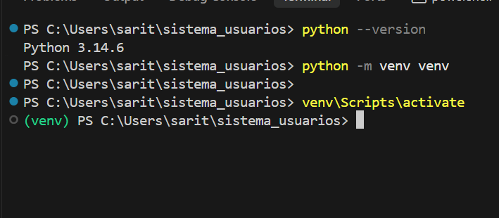
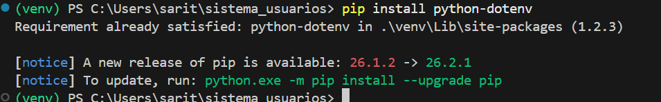
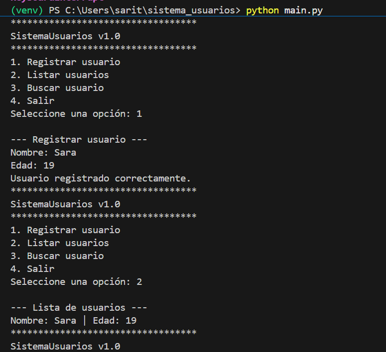
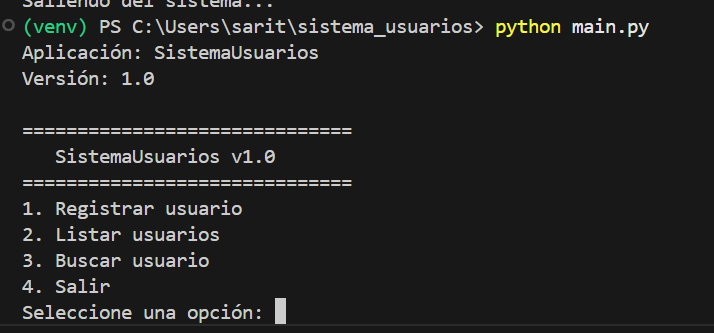

# Sistema Modular de Configuración y Gestión de Usuarios

Este es un proyecto creado en Python. Sirve para registrar, listar y buscar usuarios usando la consola de comandos. El proyecto está dividido en varias partes pequeñas para que sea más fácil de entender y organizar.

# Estructura del proyecto

sistema_usuarios/
│── app/
│ │── init .py
│ │── usuarios/
│ │ │── init .py
│ │ │── gestor.py
│ │ │── validaciones.py
│ │
│ │── config/
│ │ │── init .py
│ │ │── settings.py
│
│── .env
│── main.py
│── requirements.txt
│── README.md
|── .env.example

## Requisitos Previos

Para que este programa funcione en su computador, necesita tener instalado:
- Python en su versión 3.10 o en una versión más nueva.

## Capturas de pantalla

### Creación del entorno virtual


### Instalación de dependencias


### Ejecución del sistema


### Uso de variables de entorno


## Explicación de la estructura modular del proyecto

El proyecto está organizado para separar las diferentes tareas en archivos distintos, de manera que el código no se mezcle y sea más fácil de leer. La estructura principal está dentro de una carpeta llamada `app`, que se divide en subcarpetas.

### ¿Cómo se organizó el proyecto?
El proyecto se organizó agrupando los archivos según su propósito:
- La configuración está separada en la carpeta `config`.
- Todo lo que tiene que ver con los usuarios (guardarlos, buscarlos y revisarlos) está en la carpeta `usuarios`.
- El archivo principal que inicia el programa (`main.py`) está en la raíz, junto con los archivos de configuración del entorno (`.env` y `requirements.txt`).

### ¿Cómo funciona la modularización?
La modularización funciona dividiendo las responsabilidades. En lugar de tener un archivo gigante con todo el código:
- **`app/config/settings.py`**: Solamente se encarga de leer las opciones que guardó en el archivo `.env`.
- **`app/usuarios/gestor.py`**: Solamente tiene las instrucciones para guardar, mostrar y buscar usuarios.
- **`app/usuarios/validaciones.py`**: Solamente revisa que la información escrita sea correcta antes de guardarla.
- **`main.py`**: Solamente muestra el menú principal y conecta a los demás archivos.

### ¿Cómo se manejaron las dependencias y configuraciones?
- **Dependencias**: Se utilizó un archivo llamado `requirements.txt` que contiene la lista de herramientas externas que necesita el proyecto (en este caso, `python-dotenv`). Se instalan fácilmente con el comando `pip install -r requirements.txt`.
- **Configuraciones**: Se utilizó un archivo oculto llamado `.env` para guardar variables importantes (como el nombre del proyecto o el usuario administrador). De esta forma, las configuraciones no están escritas directamente dentro del código.

### ¿Qué ventajas se encontraron usando entornos virtuales?
El uso de entornos virtuales ofrece grandes ventajas:
1. Permite instalar dependencias específicamente para este proyecto sin afectar a otros programas en el computador.
2. Evita problemas de compatibilidad si otro proyecto necesita una versión diferente de la misma herramienta.
3. Hace que sea muy fácil para otra persona descargar el proyecto e instalar exactamente lo mismo que se usó al momento de crearlo.

## Instrucciones para crear el entorno virtual

Un entorno virtual es como un espacio separado donde instalamos las herramientas del proyecto para que no se mezclen con otros programas de su computador. Siga estos pasos para crearlo:

1. Abra la consola de comandos en la carpeta donde guardó el proyecto.
2. Escriba este comando y presione la tecla Enter para crear el entorno virtual. Esto creará una nueva carpeta llamada "venv":
   ```bash
   python -m venv venv
   ```
3. Ahora necesita activar el entorno virtual. El comando depende de su computador:
   - Si usa Windows, escriba esto:
     ```bash
     venv\Scripts\activate
     ```
   - Si usa macOS o Linux, escriba esto:
     ```bash
     source venv/bin/activate
     ```
Cuando lo haga bien, verá la palabra "(venv)" al principio de su consola.

## Instrucciones para instalar las herramientas necesarias

Este proyecto necesita código extra que no viene con Python. 

Para instalar este código, asegúrese de que su entorno virtual esté activado y luego escriba este comando:
```bash
pip install -r requirements.txt
```
Esto leerá el archivo "requirements.txt" y descargará todo lo que el proyecto necesita para funcionar.

## Instrucciones para ejecutar el proyecto

Antes de iniciar el programa, necesita tener un archivo con las opciones básicas. Siga estos pasos:

1. Busque el archivo que se llama ".env.example". Este archivo tiene un ejemplo de lo que se necesita.
2. Cree una copia de ese archivo y póngale el nombre ".env". Puede hacerlo cambiando el nombre del archivo a mano, o escribiendo este comando:
   ```bash
   cp .env.example .env
   ```
3. Ahora ya puede iniciar el programa. Escriba esto en su consola:
   ```bash
   python main.py
   ```
